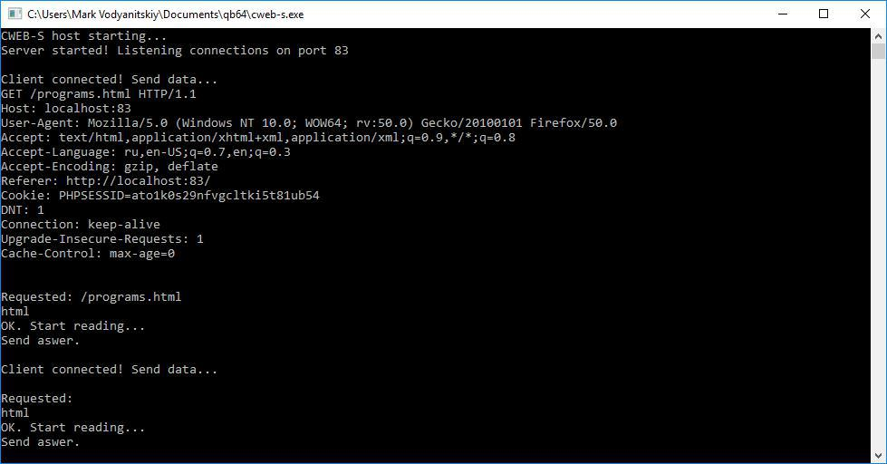

# CWEB-S
CWEB-S - Clandestine WEB Server

Подпольный веб-сервер, полностью написанный на QB64. Директория, которую выбрасывает в сеть сервер - ./web

Сервер однопоточный и крайне просто устроен. Качесто кода отавляет желать лучшего. Беременным и слабонервным код не смотреть.

